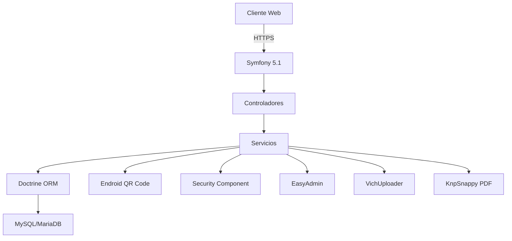

# Arquitectura del Sistema

## 1. Diagrama de Arquitectura

## 2. Componentes Principales

### 2.1 Frontend
- **Tecnologías**:
  - Twig para plantillas
  - Webpack Encore para assets
  - Bootstrap 5
  - AdminLTE 3
  - jQuery
  - CKEditor

- **Módulos Principales**:
  - Autenticación
  - Dashboard
  - Gestión de Activos
  - Mantenimientos
  - Reportes PDF
  - Generación de QR

### 2.2 Backend (Symfony 5.1)
- **Autenticación**:
  - Symfony Security
  - JWT para API
  - Roles y Permisos
  - Firewalls y Voters

- **Bundles Principales**:
  - EasyAdmin: Panel de administración
  - VichUploader: Gestión de archivos
  - KnpPaginator: Paginación
  - StofDoctrineExtensions: Extensiones de Doctrine
  - KnpSnappy: Generación de PDF
  - FOSCKEditor: Editor enriquecido

### 2.3 Base de Datos (MySQL/MariaDB)
- **Mapeo ORM**:
  - Doctrine ORM 2.7+
  - Migraciones
  - Fixtures para datos de prueba
  - Consultas DQL y QueryBuilder

- **Caché**:
  - Redis para caché de datos
  - OPcache para PHP
  - Varnish para caché HTTP

## 3. Flujo de Datos

1. **Autenticación**:
   - Cliente envía credenciales vía formulario
   - Symfony Security valida contra la base de datos
   - Se genera token JWT para autenticación
   - Se establece sesión segura con cookies HTTP-only

2. **Gestión de Activos**:
   - Formularios validados con Symfony Forms
   - Subida de archivos manejada por VichUploader
   - Datos persistidos mediante Doctrine ORM
   - Generación de códigos QR con Endroid QR Code

3. **Generación de Reportes**:
   - Plantillas Twig para diseño de reportes
   - KnpSnappy para conversión a PDF
   - Generación asíncrona para documentos grandes
   - Almacenamiento temporal en sistema de archivos

## 4. Seguridad

- **Autenticación**:
  - Symfony Security Component
  - JWT para APIs
  - Contraseñas hasheadas con Argon2i
  - Protección contra fuerza bruta

- **Autorización**:
  - Roles jerárquicos
  - Voters para lógica de negocio compleja
  - ACL para control de acceso granular

- **Protecciones**:
  - CSRF habilitado globalmente
  - CORS configurado según necesidades
  - Headers de seguridad HTTP
  - Rate limiting para APIs

## 5. Despliegue

- **Infraestructura**:
  - Servidor web: Nginx/Apache
  - PHP-FPM 7.2+
  - MySQL/MariaDB
  - Redis para caché y sesiones

- **Entornos**:
  - Desarrollo: Docker con Docker Compose
  - Producción: Servidores dedicados/cloud
  - Variables de entorno gestionadas con Dotenv

- **CI/CD**:
  - Pruebas automatizadas con PHPUnit
  - Despliegues automatizados
  - Migraciones automáticas

## 6. Monitoreo y Mantenimiento

- **Logging**:
  - Monolog para registro de eventos
  - Niveles de log configurables
  - Rotación de logs diaria

- **Monitoreo**:
  - Métricas de rendimiento
  - Health checks
  - Alertas de errores

## 7. Escalabilidad y Rendimiento

- **Estrategias**:
  - Caché HTTP con Varnish
  - Caché de consultas con Redis
  - OPcache para PHP
  - CDN para assets estáticos

- **Optimizaciones**:
  - Lazy loading de entidades
  - Consultas optimizadas con índices
  - Assets compilados y minificados
  - Compresión GZIP/Brotli

## 8. Documentación

- Documentación técnica con Markdown
- Documentación de API con OpenAPI/Swagger
- Guías de contribución
- Manual de usuario