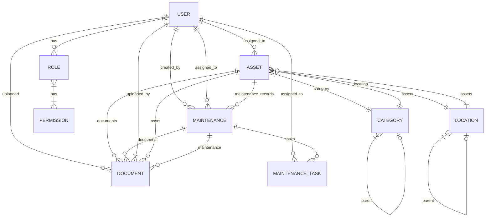

# Entity Documentation

## Core Entities

### User
- **Description**: System users with authentication credentials
- **Table**: `user`
- **Relations**:
  - Many-to-Many: `Role`
  - One-to-Many: `Asset` (assignedTo)
  - One-to-Many: `Maintenance` (assignedTo, createdBy)
- **Fields**:
  - `id`: integer, primary key, auto-increment
  - `email`: string(180), unique, not null
  - `roles`: json, not null, default: []
  - `password`: string, not null
  - `first_name`: string(50), not null
  - `last_name`: string(50), not null
  - `is_active`: boolean, default: true
  - `last_login`: datetime, nullable
  - `created_at`: datetime, not null
  - `updated_at`: datetime, nullable
  - `deleted_at`: datetime, nullable (soft delete)
- **Indexes**:
  - `idx_user_email` (email)
  - `idx_user_name` (first_name, last_name)
- **Validation**:
  - Email: @Assert\Email, @Assert\NotBlank, @Assert\Length(max=180)
  - Password: @Assert\NotBlank, @Assert\Length(min=8)
  - First/Last Name: @Assert\NotBlank, @Assert\Length(max=50)

### Asset
- **Description**: Tracked physical or digital assets
- **Table**: `asset`
- **Relations**:
  - Many-to-One: `Category` (category)
  - Many-to-One: `Location` (location)
  - Many-to-One: `User` (assignedTo), nullable
  - One-to-Many: `Maintenance` (asset)
  - One-to-Many: `Document` (asset)
- **Fields**:
  - `id`: integer, primary key, auto-increment
  - `name`: string(255), not null
  - `description`: text, nullable
  - `asset_tag`: string(100), unique, not null
  - `serial_number`: string(100), unique, nullable
  - `model_number`: string(100), nullable
  - `purchase_date`: date, nullable
  - `purchase_cost`: decimal(10,2), nullable
  - `current_value`: decimal(10,2), nullable
  - `status`: enum('available', 'assigned', 'maintenance', 'disposed'), default: 'available'
  - `warranty_expires`: date, nullable
  - `depreciation_years`: smallint, default: 5
  - `notes`: text, nullable
  - `qr_code`: string(255), nullable (path to QR code image)
  - `created_at`: datetime, not null
  - `updated_at`: datetime, nullable
  - `deleted_at`: datetime, nullable (soft delete)
- **Indexes**:
  - `idx_asset_tag` (asset_tag)
  - `idx_serial_number` (serial_number)
  - `idx_status` (status)
  - `fk_category` (category_id)
  - `fk_location` (location_id)
  - `fk_assigned_to` (assigned_to_id)
- **Validation**:
  - Name: @Assert\NotBlank, @Assert\Length(max=255)
  - Asset Tag: @Assert\NotBlank, @Assert\Regex(pattern="/^[A-Z0-9\-]+$/")
  - Purchase Cost/Current Value: @Assert\PositiveOrZero
  - Warranty Expires: @Assert\GreaterThanOrEqual("today")

### Category
- **Description**: Hierarchical classification of assets
- **Table**: `category`
- **Relations**:
  - One-to-Many: `Asset` (assets)
  - Many-to-One: `Category` (parent), nullable
  - One-to-Many: `Category` (children)
- **Fields**:
  - `id`: integer, primary key, auto-increment
  - `name`: string(100), not null
  - `description`: text, nullable
  - `code`: string(50), unique, nullable (e.g., 'IT-001')
  - `parent_id`: integer, foreign key to Category, nullable
  - `created_at`: datetime, not null
  - `updated_at`: datetime, nullable
  - `deleted_at`: datetime, nullable (soft delete)
- **Indexes**:
  - `idx_category_name` (name)
  - `idx_category_code` (code)
  - `fk_category_parent` (parent_id)
- **Validation**:
  - Name: @Assert\NotBlank, @Assert\Length(max=100)
  - Code: @Assert\Regex(pattern="/^[A-Z0-9\-]+$/")

### Location
- **Description**: Hierarchical physical or logical locations of assets
- **Table**: `location`
- **Relations**:
  - One-to-Many: `Asset` (assets)
  - Many-to-One: `Location` (parent), nullable
  - One-to-Many: `Location` (children)
  - Many-to-One: `User` (manager), nullable
- **Fields**:
  - `id`: integer, primary key, auto-increment
  - `name`: string(100), not null
  - `code`: string(50), unique, nullable (e.g., 'BLDG-A-01')
  - `description`: text, nullable
  - `address`: text, nullable
  - `contact_person`: string(100), nullable
  - `contact_phone`: string(20), nullable
  - `contact_email`: string(180), nullable
  - `parent_id`: integer, foreign key to Location, nullable
  - `manager_id`: integer, foreign key to User, nullable
  - `is_active`: boolean, default: true
  - `created_at`: datetime, not null
  - `updated_at`: datetime, nullable
  - `deleted_at`: datetime, nullable (soft delete)
- **Indexes**:
  - `idx_location_name` (name)
  - `idx_location_code` (code)
  - `fk_location_parent` (parent_id)
  - `fk_location_manager` (manager_id)
- **Validation**:
  - Name: @Assert\NotBlank, @Assert\Length(max=100)
  - Code: @Assert\Regex(pattern="/^[A-Z0-9\-]+$/")
  - Contact Email: @Assert\Email, @Assert\Length(max=180)

### Maintenance
- **Description**: Maintenance and service records for assets
- **Table**: `maintenance`
- **Relations**:
  - Many-to-One: `Asset` (asset), not null
  - Many-to-One: `User` (assignedTo), nullable
  - Many-to-One: `User` (createdBy), not null
  - One-to-Many: `MaintenanceTask` (tasks)
  - One-to-Many: `Document` (documents)
- **Fields**:
  - `id`: integer, primary key, auto-increment
  - `title`: string(255), not null
  - `description`: text, nullable
  - `type`: enum('preventive', 'corrective', 'inspection', 'upgrade'), not null
  - `priority`: enum('low', 'medium', 'high', 'critical'), default: 'medium'
  - `status`: enum('pending', 'in_progress', 'on_hold', 'completed', 'cancelled'), default: 'pending'
  - `scheduled_date`: datetime, nullable
  - `start_date`: datetime, nullable
  - `end_date`: datetime, nullable
  - `estimated_hours`: decimal(5,2), nullable
  - `actual_hours`: decimal(5,2), nullable
  - `cost`: decimal(10,2), nullable
  - `notes`: text, nullable
  - `created_at`: datetime, not null
  - `updated_at`: datetime, nullable
  - `deleted_at`: datetime, nullable (soft delete)
- **Indexes**:
  - `idx_maintenance_status` (status)
  - `idx_maintenance_type` (type)
  - `idx_maintenance_dates` (scheduled_date, start_date, end_date)
  - `fk_maintenance_asset` (asset_id)
  - `fk_maintenance_assigned` (assigned_to_id)
  - `fk_maintenance_creator` (created_by_id)
- **Validation**:
  - Title: @Assert\NotBlank, @Assert\Length(max=255)
  - Scheduled/Start/End Dates: @Assert\GreaterThan("yesterday")
  - Cost/Estimated Hours/Actual Hours: @Assert\PositiveOrZero

## Supporting Entities

### Role
- **Description**: User roles and permissions
- **Table**: `role`
- **Relations**:
  - Many-to-Many: `User` (users)
  - Many-to-Many: `Permission` (permissions)
- **Fields**:
  - `id`: integer, primary key, auto-increment
  - `name`: string(50), unique, not null (e.g., 'ROLE_ADMIN', 'ROLE_TECHNICIAN')
  - `description`: text, nullable
  - `is_system`: boolean, default: false
  - `created_at`: datetime, not null
  - `updated_at`: datetime, nullable
- **Indexes**:
  - `idx_role_name` (name)
- **Validation**:
  - Name: @Assert\NotBlank, @Assert\Length(max=50), @Assert\Regex(pattern="/^ROLE_[A-Z]+$/")
  - Description: @Assert\Length(max=500)

### Permission
- **Description**: Granular permissions for access control
- **Table**: `permission`
- **Relations**:
  - Many-to-Many: `Role` (roles)
- **Fields**:
  - `id`: integer, primary key, auto-increment
  - `name`: string(100), unique, not null (e.g., 'ASSET_CREATE', 'USER_EDIT')
  - `description`: text, nullable
  - `module`: string(50), not null (e.g., 'Asset', 'User', 'Report')
  - `created_at`: datetime, not null
- **Indexes**:
  - `idx_permission_name` (name)
  - `idx_permission_module` (module)
- **Validation**:
  - Name: @Assert\NotBlank, @Assert\Length(max=100), @Assert\Regex(pattern="/^[A-Z_]+$/")
  - Module: @Assert\NotBlank, @Assert\Length(max=50)

### AuditLog
- **Description**: System activity tracking
- **Table**: `audit_log`
- **Relations**:
  - Many-to-One: `User` (user), nullable
- **Fields**:
  - `id`: integer, primary key, auto-increment
  - `action`: string(50), not null (e.g., 'CREATE', 'UPDATE', 'DELETE', 'LOGIN')
  - `entity_type`: string(100), not null (e.g., 'App\\Entity\\User')
  - `entity_id`: string(50), nullable
  - `entity_label`: string(255), nullable
  - `changed_data`: json, nullable
  - `ip_address`: string(45), nullable
  - `user_agent`: string(255), nullable
  - `created_at`: datetime, not null
- **Indexes**:
  - `idx_audit_action` (action)
  - `idx_audit_entity` (entity_type, entity_id)
  - `idx_audit_created` (created_at)
  - `fk_audit_user` (user_id)
- **Validation**:
  - Action: @Assert\NotBlank, @Assert\Length(max=50)
  - Entity Type: @Assert\NotBlank, @Assert\Length(max=100)

## Additional Entities

### Document
- **Description**: File attachments for assets and maintenance records
- **Table**: `document`
- **Relations**:
  - Many-to-One: `Asset` (asset), nullable
  - Many-to-One: `Maintenance` (maintenance), nullable
  - Many-to-One: `User` (uploadedBy), not null
- **Fields**:
  - `id`: integer, primary key, auto-increment
  - `name`: string(255), not null
  - `original_name`: string(255), not null
  - `mime_type`: string(100), not null
  - `size`: integer, not null (in bytes)
  - `path`: string(500), not null
  - `description`: text, nullable
  - `document_type`: enum('manual', 'warranty', 'invoice', 'other'), default: 'other'
  - `is_public`: boolean, default: false
  - `uploaded_at`: datetime, not null
  - `updated_at`: datetime, nullable
- **Indexes**:
  - `idx_document_name` (name)
  - `idx_document_type` (document_type)
  - `fk_document_asset` (asset_id)
  - `fk_document_maintenance` (maintenance_id)
  - `fk_document_uploader` (uploaded_by_id)
- **Validation**:
  - Name: @Assert\NotBlank, @Assert\Length(max=255)
  - File: @Vich\UploadableField, @Assert\File(maxSize="10M")

### MaintenanceTask
- **Description**: Individual tasks within a maintenance record
- **Table**: `maintenance_task`
- **Relations**:
  - Many-to-One: `Maintenance` (maintenance), not null
  - Many-to-One: `User` (assignedTo), nullable
- **Fields**:
  - `id`: integer, primary key, auto-increment
  - `description`: text, not null
  - `status`: enum('pending', 'in_progress', 'completed', 'skipped'), default: 'pending'
  - `priority`: enum('low', 'medium', 'high'), default: 'medium'
  - `estimated_hours`: decimal(4,2), nullable
  - `actual_hours`: decimal(4,2), nullable
  - `completed_at`: datetime, nullable
  - `notes`: text, nullable
  - `sort_order`: integer, default: 0
  - `created_at`: datetime, not null
  - `updated_at`: datetime, nullable
- **Indexes**:
  - `idx_maintenance_task_status` (status)
  - `fk_maintenance_task_maintenance` (maintenance_id)
  - `fk_maintenance_task_assignee` (assigned_to_id)
- **Validation**:
  - Description: @Assert\NotBlank
  - Estimated/Actual Hours: @Assert\PositiveOrZero

### Settings
- **Description**: System configuration settings
- **Table**: `setting`
- **Fields**:
  - `id`: integer, primary key, auto-increment
  - `name`: string(100), unique, not null
  - `value`: text, nullable
  - `type`: enum('string', 'integer', 'float', 'boolean', 'array', 'json'), default: 'string'
  - `description`: text, nullable
  - `is_public`: boolean, default: false
  - `created_at`: datetime, not null
  - `updated_at`: datetime, nullable
- **Indexes**:
  - `idx_setting_name` (name)
  - `idx_setting_public` (is_public)
- **Validation**:
  - Name: @Assert\NotBlank, @Assert\Length(max=100), @Assert\Regex(pattern="/^[a-z][a-z0-9_.]+$/")
  - Value: @Assert\NotBlank

## Entity Relationships

## Common Enums

### AssetStatus
- `available`: Available for assignment
- `assigned`: Currently assigned to a user
- `maintenance`: Under maintenance
- `disposed`: No longer in use

### MaintenanceStatus
- `pending`: Scheduled but not started
- `in_progress`: Currently being worked on
- `completed`: Successfully finished
- `cancelled`: Cancelled before completion

## Data Validation Rules

### Asset
- `name`: Required, max 255 chars
- `assetTag`: Required, unique, alphanumeric with dashes
- `serialNumber`: Required if physical asset
- `purchaseCost`: Numeric, min 0, max 1,000,000
- `status`: Must be one of defined enum values

### User
- `email`: Required, valid email format
- `username`: Required, alphanumeric with underscores
- `password`: Min 8 chars, requires uppercase, lowercase, number, and special char